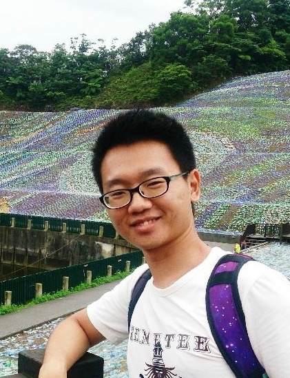
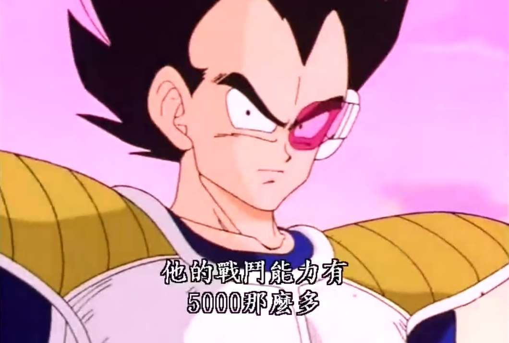
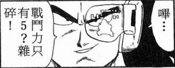

footer: Che-Chia David Chang, 2018,  [https://github.com/chechiachang/scouter](https://github.com/chechiachang/scouter)
slidenumbers: true

# AR + FR 開源戰鬥力探測器

---

David Chang: Back-End Developer, Kuberentes admin, DevOps

---

# 開源戰鬥力探測器 Scouter

起因
- 七龍珠
- COSCUP

---

# Outline

- Live demo
- Architecture
  Data mining
  Face detection & recognition

---

# Feature & Architecture

- 頭像圖檔 + 開源貢獻數據 - Github api + go-github (Golang)
- 人臉辨識特徵值產生      - Face detection api (Python)
- API server 與資料庫串接 - Flask + PyMongodb (Python)
- 攝影視訊串流 + 人臉探測 + 前端AR UI - Unity + face tracker (C#)

---

# Data mining

1. Download user data and avatar
1. Fetch contribution statics

[Github API](https://developer.github.com/v3/)
[go-github](https://github.com/google/go-github) (Api library in Golang)

---

# Face detection & Face recognition

[The world's simplest facial recognition api](https://github.com/ageitgey/face_recognition)
Data pre-processing -> Face encoding -> Face recognition
It's really easy! 

---

# Api server

- Only one API
  - Consume face image from App
  - Produce user data to App
- Python framework: Flask

---

# App and AR unity

[Unity](https://unity3d.com/) : build app and AR UI

[OpenCV](https://opencv.org/) : image processing library

[dlib](http://dlib.net/) : face recognition tools, models and algorithms

  

---

# Workflow

|Camera|APP|API server|Face recognition|DB|API server|App|
|---|---|---|---|---|---|---|
|Video Stream|Face Image||Identify User|User Data||Show data|

---

# Issues

1. Github data source
  - 3000 human faces / 14000 avatars
2. Face recognition API tuning required
3. Unity and C# newbie

> 『不是不準，只是正確機率不夠高。』
--XD

---

# Review

|| |
|---|---|---|
|Golang crawler & html parser|Golang|
|Github API| |
|Python Flask||
|Face Recognition API| |
|Unity||
|OpenCvForUnity||
|dlib shape predictor||
|C#||

---

# 

>『因為我自己想做，還有當初推坑我的人太厲害。』
-- David Chang

---

# The end

投影片及講稿 [https://github.com/chechiachang/my-speeches/tree/master/fr-ar-open-source-power-detector](https://github.com/chechiachang/my-speeches/tree/master/fr-ar-open-source-power-detector)

開源原始碼 [https://github.com/chechiachang/scouter](https://github.com/chechiachang/scouter)

[Deckset: md to presetation](https://www.deckset.com/)

---
