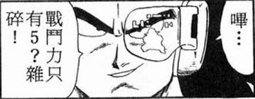
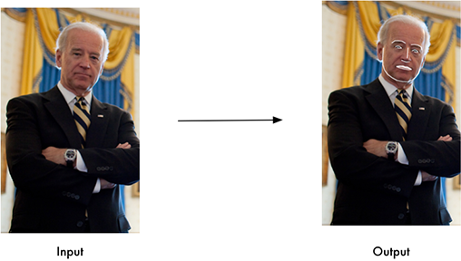
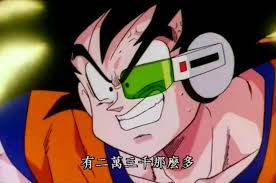

autoscale: true
footer: Che-Chia David Chang, 2018,  [https://github.com/chechiachang/scouter](https://github.com/chechiachang/scouter)
slidenumbers: true

# Scouter: Face recognition contribution detector

---

David Chang
Back-End Developer, Kuberentes admin, DevOps

---

#  Scouter: 3 reasons why

Garbage Talks with Linkers
Drangon Ball!
For COSCUP!

---

# Let's Live Demo!

---

# Outline

  Data mining
  Face detection & recognition

---

# Feature & Architecture

- Face + Contributino           ----> Github api + go-github (Golang)
- Face Recognitiion             ----> Face detection api (Python)
- API server + Database         ----> Flask + PyMongodb (Python)
- Webcam + AR + Face detection  ----> Unity + face tracker (C#)

---

# Face and User Data Mining

1. Download user data and avatar
1. Fetch contribution statics

[Github API](https://developer.github.com/v3/)
[go-github](https://github.com/google/go-github) (Api library in Golang)

---

# 4 Data Miners (Golang)

1. User fetcher -- fetch user data with search API
2. User detail fetcher -- fetch user detail with user API
3. Avatar downloader -- fetch user's avatar by user data
4. Contribution fetcher -- parse github contribution HTML

---

# Notes about Github API

1. API paging limit
  Search API only return first 1000 users
2. API request limit
  Search API 30 query / min
  User API 50000 query / hour
3. Parallel request with Wait Group (Optional)

https://api.github.com/search/users?q=location:taiwan+created:2008-01-01..2008-02-01&sort=joined&order=asc

---

# Face detection & Face recognition

[The world's simplest facial recognition api](https://github.com/ageitgey/face_recognition)
Data pre-processing -> Face encoding -> Face recognition
It's really easy! 

---

# Face detection & Face recognition

1. Detect face from avatars
2. Detect identities face image
3. Store identities and userID in a 'big' matrix
4. Detect face from a unknown image
5. Compare unknown face with matrix
   find the distances between all face identities

---

# Api server

1. Consume face image from App
2. Detect face from image and recogniize user by face identity
3. Get user data from DB and return to App

---

# App Workflow

||||||||
|---|---|---|---|---|---|---|
|Camera|APP|API server|Face recognition|DB|API server|App|
|Video Stream|Face Image||Identify User|User Data||Show data|

---

# App and AR unity

[Unity](https://unity3d.com/) : build app and AR UI

[OpenCV](https://opencv.org/) : image processing library

[dlib](http://dlib.net/) : face recognition tools, models and algorithms

  

---

# Unity App

1. Control camera
2. Detect face on App-side with face tracker
3. Cut and Send face to API server and get user data back
4. Display user data to view

---

# Issues

1. Github data source
  Nobody use their won face! 3000 human faces / 14000 avatars
  Github avatar has very low resolution
2. Face recognition API tuning required
3. I'm a Unity and C# newbie ;)

> 『不是不準，只是正確機率不夠高。』
--XD

---

# Review

|| |
|---|---|---|
|Golang crawler & html parser|Golang|
|Github API| |
|Python Flask||
|Face Recognition API| |
|Unity||
|OpenCvForUnity||
|dlib shape predictor||
|C#||

---

# How

我想分享的是一個越級打怪，一邊快速成長的捷徑:

挑幾個不會的題目，然後去報 COSCUP 講一個 session

---

#  The end

COSCUP 充滿了愛與勇氣的故事

我們不是在寫客戶要的，公司要的，主管要的。工作上也有很多有趣的事情。
我們在做自己想做的東西。

最後送大家一句話。

---

# 

>『因為我自己想做，還有當初推坑我的人太厲害。』
-- David Chang, 2018 COSCUP

---

# The end

投影片及講稿 [https://github.com/chechiachang/my-speeches/tree/master/fr-ar-open-source-power-detector](https://github.com/chechiachang/my-speeches/tree/master/fr-ar-open-source-power-detector)

開源原始碼 [https://github.com/chechiachang/scouter](https://github.com/chechiachang/scouter)

[Deckset: md to presetation](https://www.deckset.com/)

---
