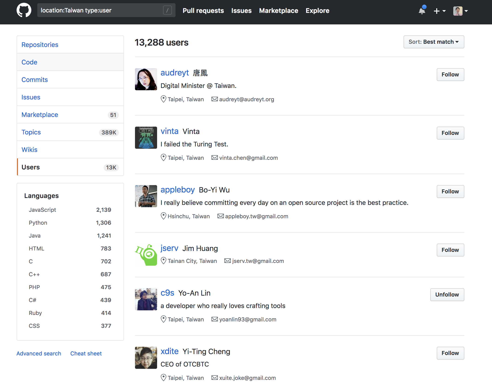
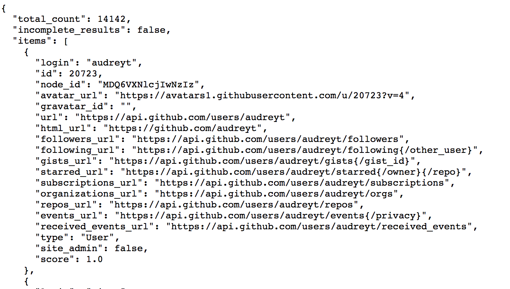
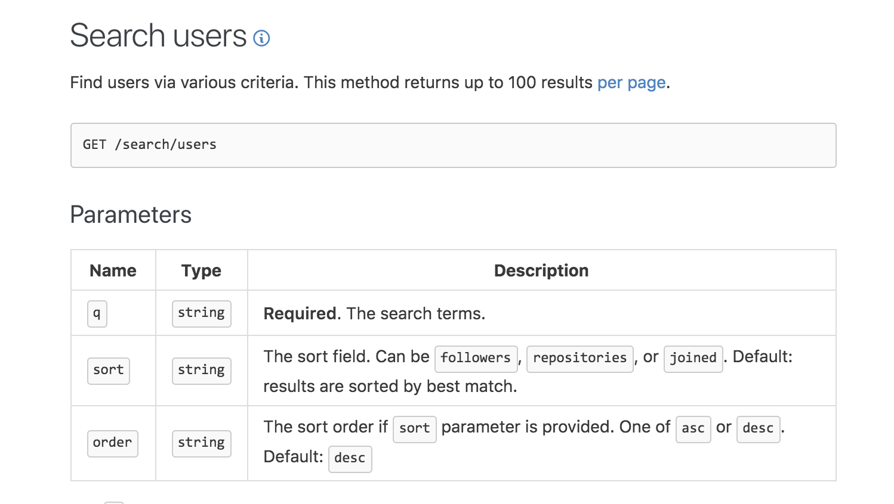
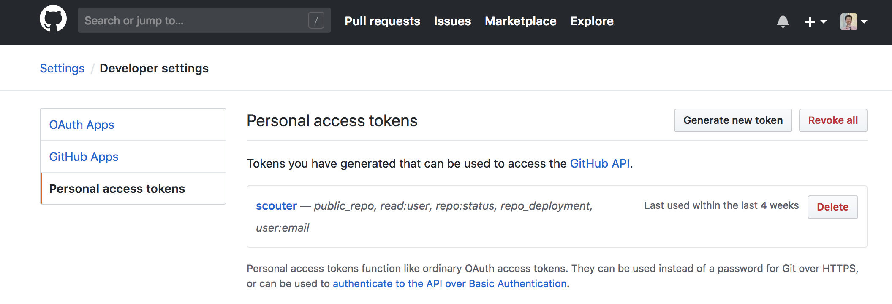
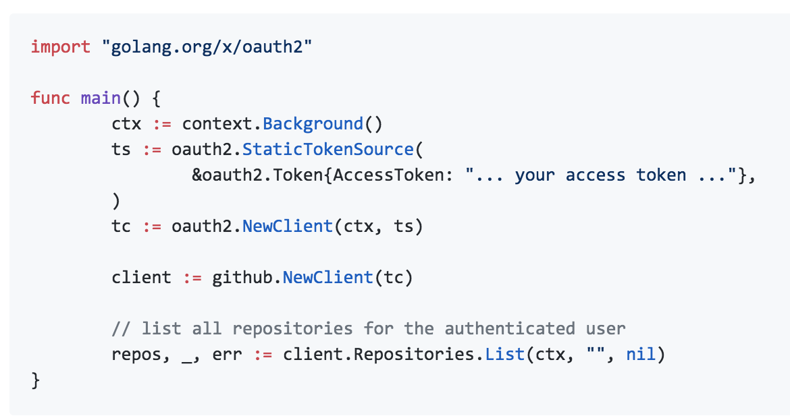
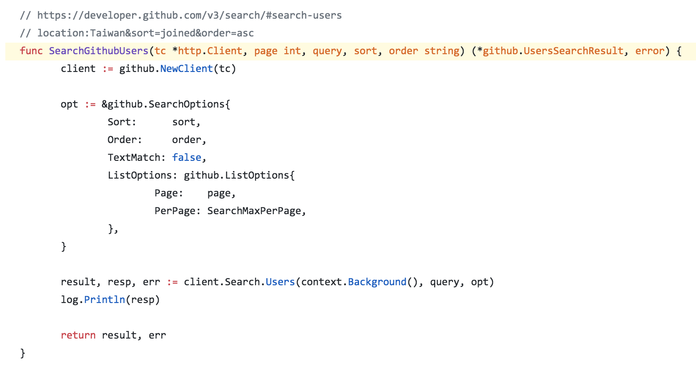

footer: Che-Chia David Chang, 2018,  [https://github.com/chechiachang/my-speeches/tree/master/go-github](https://github.com/chechiachang/my-speeches/tree/master/go-github)
slidenumbers: true

# Github API with Go-Github

---

David Chang
Back-End Developer, Kuberentes admin, DevOps

---

# Outline

1. Let's try Github API
2. Use github API with go-github
3. Work with limitation of github API
4. An application of github user data

---

# Let's Try Github API

Get data of a user with username

Web page

[https://github.com/chechiachang](https://github.com/chechiachang)

Api

[https://api.github.com/users/chechiachang](https://api.github.com/users/chechiachang)

---

[https://github.com/search?q=location:Taiwan+type:user](https://github.com/search?q=location:Taiwan+type:user)

---

[/users?q=location:Taiwan&sort=followers&order=desc](https://api.github.com/search/users?q=location:Taiwan&sort=followers&order=desc)

---

[Github Search User API Docs](https://developer.github.com/v3/search/#search-users)

---

# Github API Authentication

- Most API requires authentication
- [https://developer.github.com/v3/#authentication](https://developer.github.com/v3/#authentication)
- Let's generate api access token from web page

---

Github -> User -> settings -> Developer settings -> Personal access tokens

---

# Go-github

- Provide programmatic way to access APIs
- A client library for accessing github API in golang

[https://github.com/google/go-github](https://github.com/google/go-github)

---

---

[https://github.com/chechiachang/scouter/blob/master/github.go#L44](https://github.com/chechiachang/scouter/blob/master/github.go)

--- 

# Limitation of Github API

1. API paging limit: Search API only return first 1000 users
2. API request limit
  Search API 30 query / min
  User API 50000 query / hour

[/users?q=location:taiwan+created:2008-01-01..2008-02-01&sort=joined&order=asc](https://api.github.com/search/users?q=location:taiwan+created:2008-01-01..2008-02-01&sort=joined&order=asc)

---

# Work with limitation

1. Paging limit: narrow down search query with time interval
2. Control your requests rate 
   One of the easist ways is time.Sleep()

[https://github.com/chechiachang/scouter/blob/master/cmd/user_fetcher/main.go#L68](https://github.com/chechiachang/scouter/blob/master/cmd/user_fetcher/main.go)

---

# Application: User Data Miners

- Use access token
- Add Query, SearchOption, Sort, Order, ListOption ...
- fetch user data with search API

[https://github.com/chechiachang/scouter/blob/master/cmd/user_fetcher/main.go](https://github.com/chechiachang/scouter/blob/master/cmd/user_fetcher/main.go)

---

# An Application Using Github Data

Scouter [https://github.com/chechiachang/scouter](https://github.com/chechiachang/scouter)

Let's Live Demo

---

# An Application Using Github Data

- User Data Miners to fetch user details, avatars, and contribution
- Face detection & Face recognition
- Api server

Video Stream -> Face Image -> Identify User -> User Data -> Show data

---

# The end
