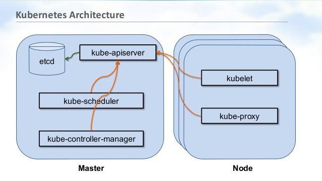
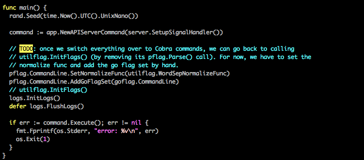
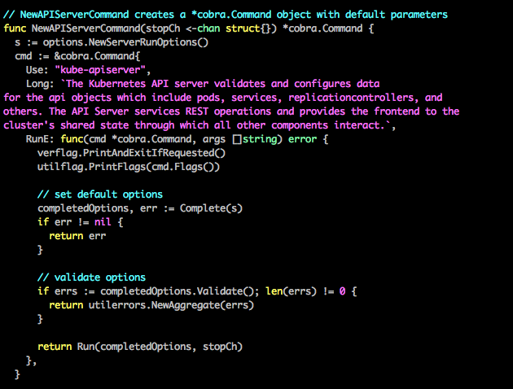
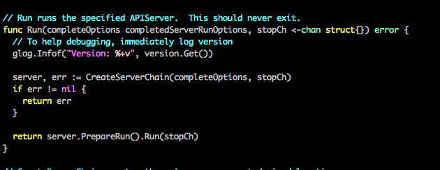
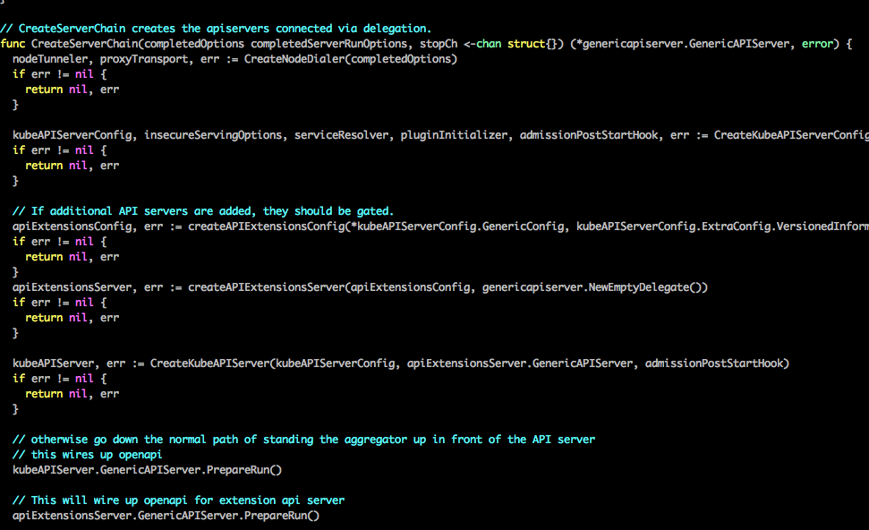
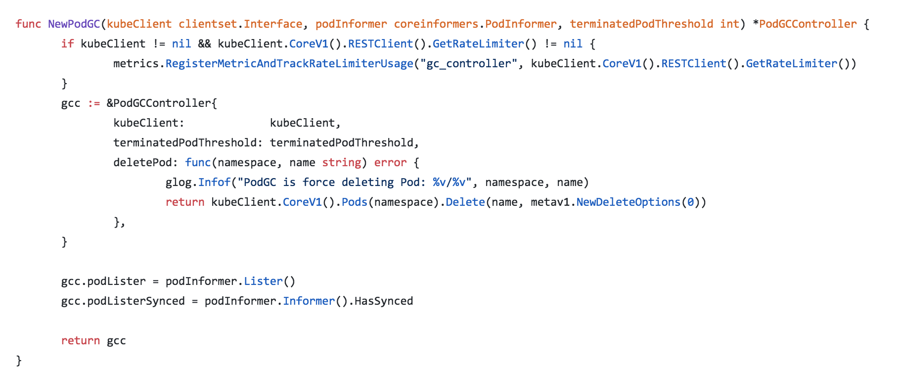
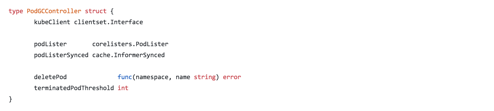

footer: Che-Chia David Chang, 2018,  [https://github.com/chechiachang](https://github.com/chechiachang)
slidenumbers: true

# Read Source Code: Kubernetes API server

---

David Chang
Back-End Developer, Kuberentes admin, DevOps


---

# Outline

- Before read source code
- Let's read Source Code the hard way
- Let's read Source Code the esay way


---

# Why read kube-apiserver

1. Kubernetes source code contributors
2. Developers using go-client to integrate Kubernetes
3. Distributed architecture Design
4. For fun (?)

---

# Before read kube-apiserver

- Understand kube-apiserver architecture 
[Official Tutorial: Access API](https://kubernetes.io/docs/tasks/administer-cluster/access-cluster-api)
[What happens when k8s](https://github.com/jamiehannaford/what-happens-when-k8s)
[Deep Dive API server](https://blog.openshift.com/kubernetes-deep-dive-api-server-part-1/)

- Design concepts

- A running kubernetes. Try this
[Katacoda](https://www.katacoda.com/courses/kubernetes/playground)

---

# kube-apiserver architecture

What's kube-apiserver:

- Component on the master that exposes the Kubernetes API. It is the front-end for the Kubernetes control plane. 
- It is designed to scale horizontally – that is, it scales by deploying more instances.

---

# kube-apiserver architecture



---

cmd/kube-apiserver/apiserver.go

```
$ ./kube-apiserver [args...]
```


---

NewApiServerCommand: cmd/kube-apiserver/app/server.go



---

server.Run: cmd/kube-apiserver/app/server.go



---

ServerChaing: cmd/kube-apiserver/app/server.go



---

# Kube-apiserver 

- cmd/apiverser
  - Options
- CreateServerChain
- AggregatedServer
  - divide the single monolithic API server into multiple aggregated servers
  - Extend customized api
  - Authentication Chain

---

# Still with me?

Let's try another way.

---

# Let's read Source Code with Merged PRs


[https://github.com/kubernetes/kubernetes](https://github.com/kubernetes/kubernetes)

1. Go through the whold go file from top to buttom. 
-> Not recommended.

2. Start from bugs, issues, or PRs.

3. Use filter
is:pr label:sig/api-machinery label:approved

---

# Find a 'short' PR

is:pr label:sig/api-machinery label:approved

[https://github.com/kubernetes/kubernetes/pulls?utf8=%E2%9C%93&q=is%3Apr+label%3Asig%2Fapi-machinery+label%3Aapproved](https://github.com/kubernetes/kubernetes/pulls?utf8=%E2%9C%93&q=is%3Apr+label%3Asig%2Fapi-machinery+label%3Aapproved)

---

# Example: an easy PR

[https://github.com/kubernetes/kubernetes/pull/66851](https://github.com/kubernetes/kubernetes/pull/66851)

---

# Let's learn Pod GC Controller



---

# Let's learn Pod GC Controller



---

# Better flow

Find your interest
  - Find a feature, an issue, ...
  - Read document
  - Join a kubernetes special interest group

[https://github.com/kubernetes/community/blob/master/sig-list.md](https://github.com/kubernetes/community/blob/master/sig-list.md)

---

# Tips

  - Read document first, then source code
  - Read comment first, then source code
  - Read github Issues and PRs

--

# End
